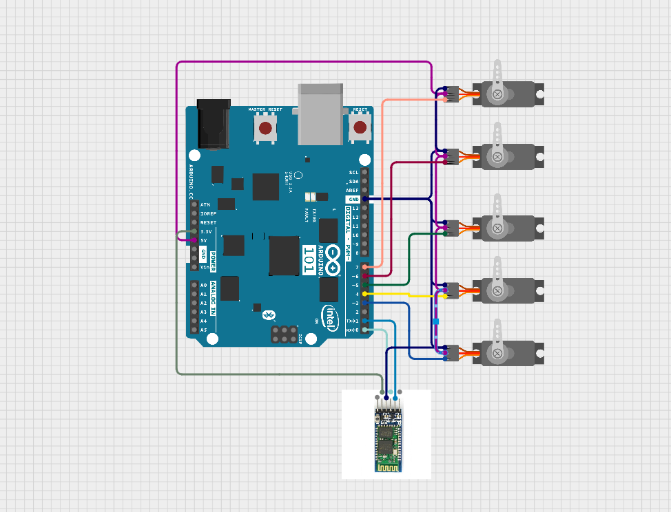

# 🤖 Bionic Arm Control using Arduino & Bluetooth

This project demonstrates a **Bionic Arm controlled via Bluetooth or Serial Monitor** using **Arduino UNO** and **5 servo motors** to mimic a human hand. Commands can be sent via Bluetooth (HC-05) or the Serial Monitor.

---

## 📌 Features
✔ Control 5 servo motors (thumb, index, middle, ring, little finger)  
✔ Bluetooth & Serial Monitor control  
✔ Predefined and custom positions  
✔ Simple and expandable design  

---

## 🛠 Components Required
- Arduino UNO
- 5 × Servo Motors (SG90 or MG90)
- Bluetooth Module (HC-05)
- External 5V Power Supply (recommended)
- Jumper Wires
- Breadboard

---

## ⚡ Pin Configuration

| Component            | Arduino Pin |
|----------------------|------------|
| Servo 1 (Thumb)      | 3          |
| Servo 2 (Middle)     | 4          |
| Servo 3 (Index)      | 5          |
| Servo 4 (Ring)       | 6          |
| Servo 5 (Little)     | 7          |
| Bluetooth TX →       | RX (Pin 0)|
| Bluetooth RX →       | TX (Pin 1)|
| Bluetooth VCC →      | 5V        |
| Bluetooth GND →      | GND       |

**Note:** Use a 5V external power supply (2A or more) for servos and connect **common GND** with Arduino.

---

## 📷 Circuit Diagram

---

## ▶️ Working Video
[Watch Demo Video](working%20(2).mp4)  
*(Alternatively, upload the video to YouTube and replace this link for better accessibility.)*

---

## 💻 Arduino Code
T✅ How to Use
Upload bionicarmcode.ino to your Arduino UNO.

Open Serial Monitor (baud: 9600, No line ending).

Send:

0 to 5 or f, c, d → Control positions.

Pair HC-05 with your phone and use a Bluetooth terminal app for wireless control.

🚀 Future Scope
✔ Flex Sensor Glove-based Control
✔ Voice Command Integration
✔ IoT & Wireless Control with ESP32
✔ AI Gesture Predictionhe full code is in **[bionicarmcode.ino](bionicarmcode.ino)**.  

